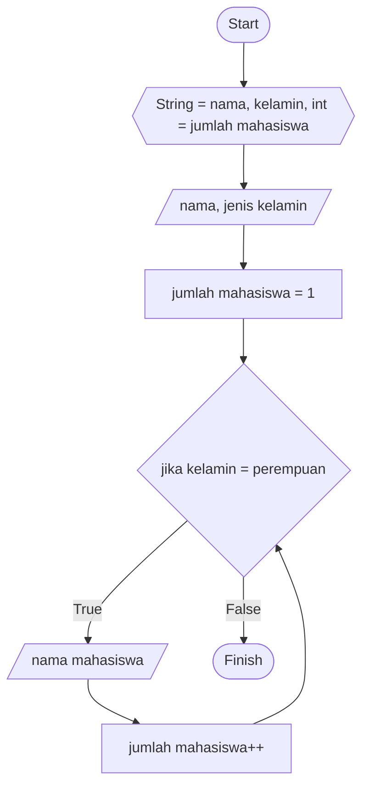

# Flowchart #

```mermaid
flowchart TD;
1([Start])-->2{{String = nama, kelamin, int = jumlah mahasiswa}};
2{{String = nama, kelamin, int = jumlah mahasiswa}}-->3[/nama, jenis kelamin/];
3[/nama, jenis kelamin/]-->4[jumlah mahasiswa = 1];
4[jumlah mahasiswa = 1]-->5{jika kelamin = perempuan};
5{jika kelamin = perempuan}-->|True|6[/nama mahasiswa/];
5{jika kelamin = perempuan}-->|False|7([Finish]);
6[/nama mahasiswa/]-->8[jumlah mahasiswa++];
8[jumlah mahasiswa++]-->5{jika kelamin = perempuan};

```
